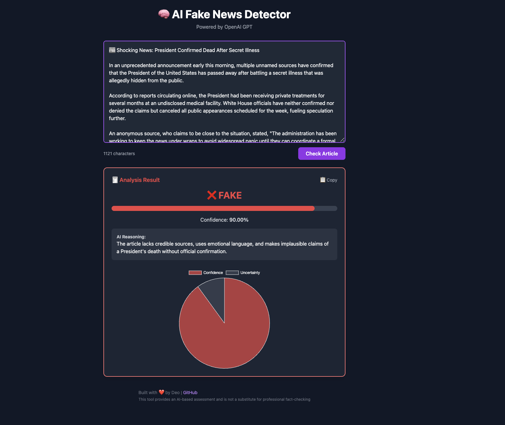
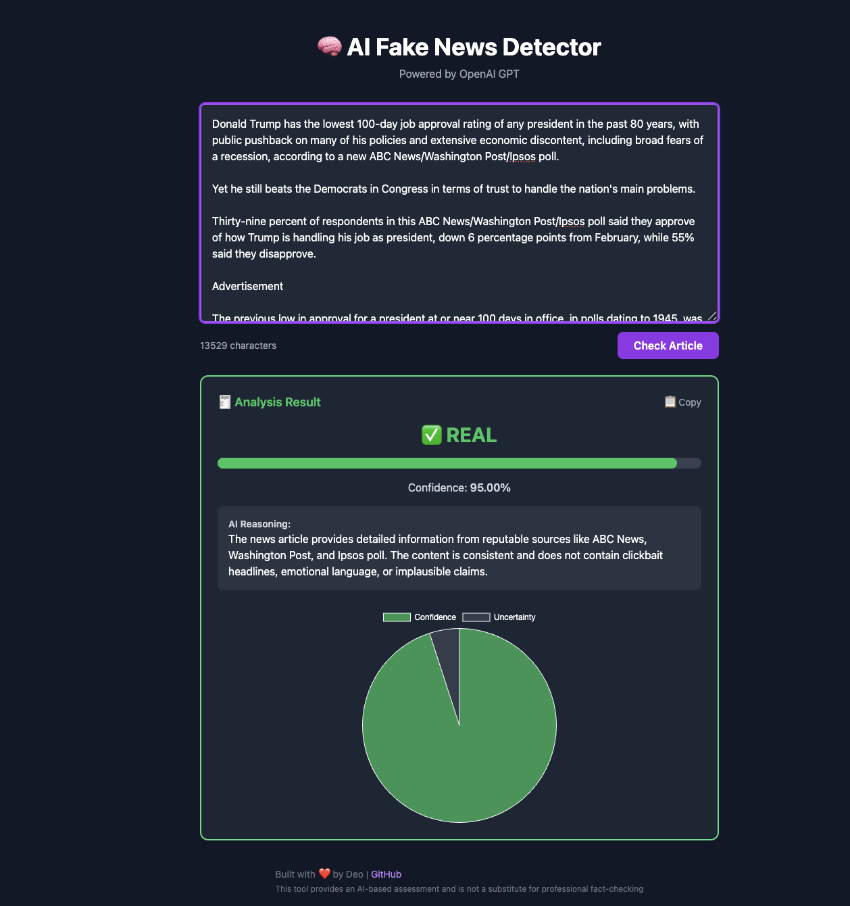

# 📰 AI Fake News Detector

<p align="center">
  <a href="https://lens2199.github.io/ai-fake-news-detector/" target="_blank">
    
  </a>
</p>

<p align="center">
  
  
  
  
  
</p>

---

A full-stack AI-powered web application that detects whether a news article is **Real** ✅ or **Fake** ❌ using OpenAI's GPT models.

🚀 **Live Frontend:** [AI Fake News Detector Frontend](https://lens2199.github.io/ai-fake-news-detector/)  
🛠 **Backend API:** [AI Fake News Detector Backend](https://ai-fake-news-detector-production.up.railway.app/)

🚀 **Live Frontend:** [AI Fake News Detector Frontend](https://lens2199.github.io/ai-fake-news-detector/)  
🛠 **Backend API:** [AI Fake News Detector Backend](https://ai-fake-news-detector-production.up.railway.app/)

---

## 📸 Project Screenshots

### ❌ Fake News Detection Example


---

### ✅ Real News Detection Example


---

## 🎯 Features

- ✍️ Submit any news article text
- 🧠 AI analyzes credibility, emotional language, sources, and factual consistency
- 🎯 Predicts if the article is "Real" or "Fake" with a **confidence score**
- 📊 Visualizes results with a pie chart and confidence bar
- 🖥 Clean, responsive dark-mode user interface
- 💬 Displays detailed AI reasoning for each verdict
- ⏳ Loading animations during AI analysis
- ⚠️ Proper error handling for API failures
- 🛡 Backend protected with environment variables and CORS settings

---

## 🛠 Tech Stack

**Frontend:**
- React.js
- TailwindCSS
- Chart.js
- GitHub Pages (deployment)

**Backend:**
- Node.js
- Express.js
- OpenAI API (GPT-4)
- Railway (deployment)

---

## 📂 Project Structure

ai-fake-news-detector/ ├── backend/ # Express server for analysis requests ├── frontend/ # React application ├── images/ # Project screenshots ├── README.md └── package.json


---

## ⚙️ How It Works

1. User submits a news article text via the frontend form.
2. Frontend sends a POST request to the backend `/analyze` endpoint.
3. Backend forwards the text to OpenAI GPT-4 using a carefully engineered prompt.
4. GPT-4 responds with a JSON object containing:
   - Label: Real ✅ or Fake ❌
   - Confidence score
   - Reasoning explanation
5. Frontend displays the result beautifully with confidence visualizations and reasoning.

---

## 🚀 How to Run Locally

### 1. Clone the Repository

```bash
git clone https://github.com/Lens2199/ai-fake-news-detector.git
cd ai-fake-news-detector


Setup Backend

cd backend
npm install
# Create a .env file with your OpenAI API key
echo "OPENAI_API_KEY=your-api-key-here" > .env
npm start


Setup Frontend

cd ../frontend
npm install
npm start


