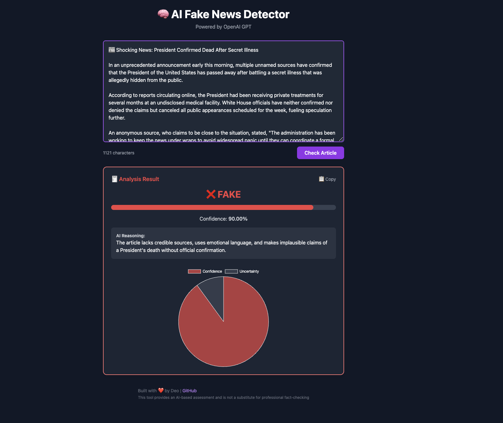
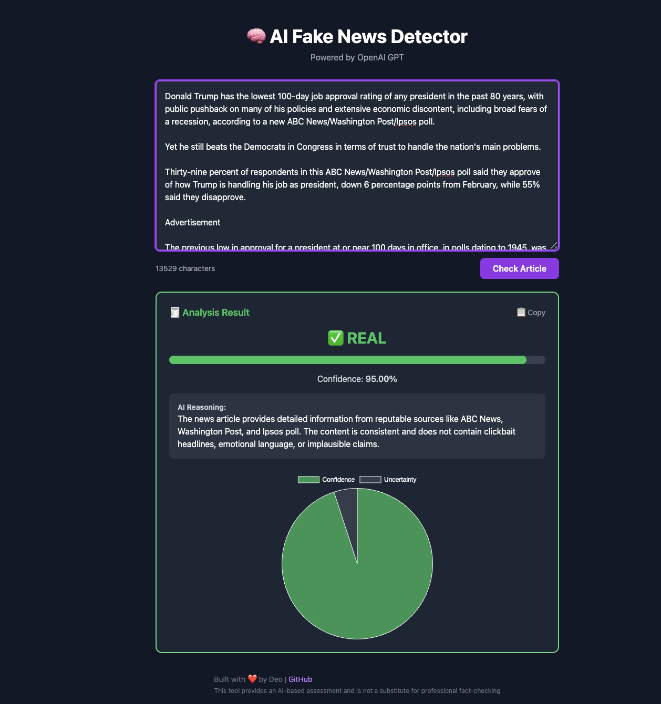

# 📰 AI Fake News Detector

A full-stack AI-powered web application that detects whether a news article is **Real** ✅ or **Fake** ❌ using OpenAI's GPT models.

🚀 **Live Demo:** [AI Fake News Detector Frontend](https://lens2199.github.io/ai-fake-news-detector/)  
🛠 **Backend API:** [AI Fake News Detector Backend](https://ai-fake-news-detector-production.up.railway.app/)

---

## 📸 Project Screenshots

## 📸 Project Screenshots

### ❌ Fake News Detection Example

---

### ✅ Real News Detection Example

## 🎯 Features

- ✍️ Submit any news article text
- 🧠 AI analyzes credibility, emotional language, sources, and bias
- 🎯 Predicts if the article is "Real" or "Fake" with a **confidence score**
- 📊 Visualizes results with a pie chart and confidence bar
- 🔥 Clean dark-mode UI with responsive design
- 💬 Shows detailed AI reasoning for verdicts
- ⏳ Loading animations and error handling
- 🛡 Secure backend API with environment variable protection

---

## 🛠 Tech Stack

**Frontend:**
- React.js
- TailwindCSS
- Chart.js
- GitHub Pages (deployment)

**Backend:**
- Node.js
- Express.js
- OpenAI API (GPT-4)
- Railway (deployment)

